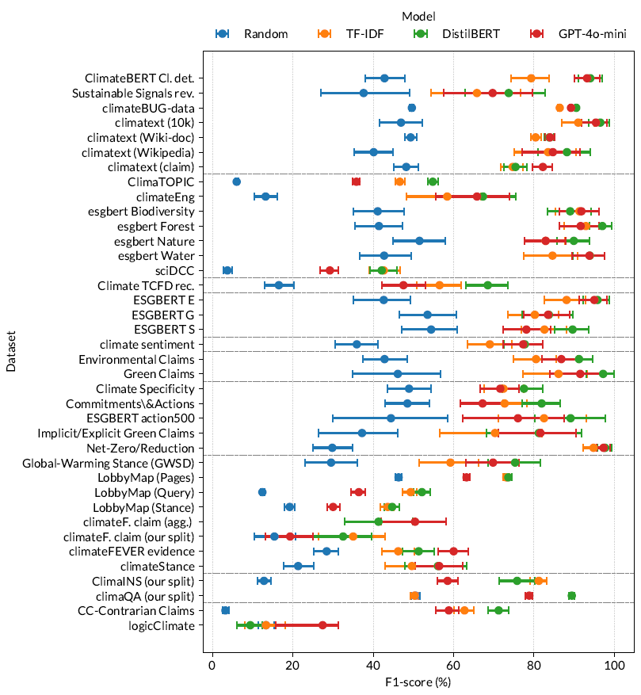

# Benchmarking the Benchmarks: Reproducing Climate-Related NLP Tasks

## Introduction

This repository supports our paper: **"Benchmarking the Benchmarks: Reproducing Climate-Related NLP Tasks"**.  
We systematically evaluate 29 datasets spanning various climate-related NLP tasks, from topic detection to stance detection and fallacy detection.

# Results and Contribution

In this study, we find that simple TF-IDF baselines perform surprisingly well, indicating that many of the evaluated tasks and datasets rely heavily on superficial linguistic cues such as term frequency. Furthermore, while fine-tuned transformer models tend to outperform large language models (LLMs) in terms of raw performance metrics, our error analysis suggests that this advantage might stem from overfitting to annotation noise rather than genuine improvements.




## Datasets and Tasks

In this study we tackle a large set of climate-related NLP tasks. You can collect each of the datasets using the table below, and run the preprocessing steps to produce the same dataset as ours


| Category                        | Dataset                                                                                                | Authors                                                                                            | Input                                         | Labels                                          | Description                                                    |
|:--------------------------------|:-------------------------------------------------------------------------------------------------------|:---------------------------------------------------------------------------------------------------|:----------------------------------------------|:------------------------------------------------|:---------------------------------------------------------------|
| Climate-Related Topic Detection | [ClimateBug-data](https://huggingface.co/lumilogic)                                                    | [Yu et al. (2024)](https://www.sciencedirect.com/science/article/pii/S0957417423026647?via%3Dihub) | Sentences from banks’ reports                 | Relevant / Irrelevant                           | Climate change and sustainability (ESG, SDGs, recycling, etc.) |
| Climate-Related Topic Detection | [ClimateBERT detection](https://huggingface.co/datasets/climatebert/climate_detection)                 | [Bingler et al. (2023)](https://papers.ssrn.com/sol3/papers.cfm?abstract_id=4000708)               | Paragraphs from reports                       | 1 / 0                                           | Climate policy, climate change, or environmental topic         |
| Climate-Related Topic Detection | [Climatext](https://www.sustainablefinance.uzh.ch/en/research/climate-fever/climatext.html)            | [Varini et al. (2020)](https://arxiv.org/abs/2012.00483)                                           | Sentences from Wikipedia, 10-Ks, web scraping | 1 / 0                                           | Directly related to climate change                             |
| Climate-Related Topic Detection | [Climatext (wiki-doc)](https://www.sustainablefinance.uzh.ch/en/research/climate-fever/climatext.html) | [Varini et al. (2020)](https://arxiv.org/abs/2012.00483)                                           | Sentences from Wikipedia page                 | 1 / 0                                           | From page related to climate change                            |
| Climate-Related Topic Detection | [Sustainable Signals](https://socialmediaarchive.org/record/45?ln=en&v=pdf)                            | [Lin et al. (2023)](https://www.ijcai.org/proceedings/2023/673)                                    | Online product reviews                        | Relevant / Irrelevant                           | Contains terms related to sustainability                       |
| Thematic Analysis               | [TCFD rec.](https://huggingface.co/datasets/climatebert/tcfd_recommendations)                          | [Bingler et al. (2021)](https://papers.ssrn.com/sol3/papers.cfm?abstract_id=3796152)               | Paragraphs from annual reports                | Metrics, Risk, Strategy, Governance, General    | TCFD’s 4 main categories                                       |
| Thematic Analysis               | [ESGBERT ESG](https://huggingface.co/datasets/ESGBERT/environment_data)                                | [Schimanski et al. (2023b)](https://papers.ssrn.com/sol3/papers.cfm?abstract_id=4622514)           | Sentences from reports and corporate news     | Environment, Social, Governance, None           | Environmental criteria incl. energy, waste, climate, etc.      |
| Thematic Analysis               | [ESGBERT Nature](https://huggingface.co/datasets/ESGBERT/WaterForestBiodiversityNature_2200)           | [Schimanski et al. (2024a)](https://papers.ssrn.com/sol3/papers.cfm?abstract_id=4665715)           | Paragraphs from reports                       | General, Nature, Biodiversity, Forest, Water    | Multi-label nature-related topics                              |
| Thematic Analysis               | [SciDCC](https://sites.google.com/view/scidccdataset)                                                  | [Mishra & Mittal (2021)](https://www.climatechange.ai/papers/icml2021/76)                          | News articles                                 | Environment, Geology, Climate, etc.             | Category of publication (automatic label)                      |
| Thematic Analysis               | [ClimateEng](https://github.com/roopalv54/finegrained-climate-change-social-media)                     | [Vaid et al. (2022)](https://aclanthology.org/2022.acl-srw.35/)                                    | Tweets (COP25)                                | Ocean, Politics, Disaster, Agriculture, General | Climate-change subtopics                                       |
| Thematic Analysis               | [ClimaTOPIC](https://huggingface.co/datasets/iceberg-nlp/climabench)                                   | [Spokoyny et al. (2023)](https://arxiv.org/abs/2301.04253)                                         | CDP responses                                 | Adaptation, Hazards, Emissions, Water, etc.     | Category of the CDP question                                   |
| Climate Risk Classification     | [ClimateBERT Sentiment](https://huggingface.co/datasets/climatebert/climate_sentiment)                 | [Bingler et al. (2023)](https://papers.ssrn.com/sol3/papers.cfm?abstract_id=4000708)               | Paragraphs from annual reports                | Risk, Opportunity, Neutral                      | Sentiment on climate risk/opportunity                          |
| Green Claim Detection           | [Green Claims](https://zenodo.org/records/5764913#.YbBjlbso9th)                                        | [Woloszyn et al. (2022)](https://dl.acm.org/doi/10.1145/3503162.3503163)                           | Marketing tweets                              | Green Claim / Not Green                         | Environmental/nature-friendly marketing                        |
| Green Claim Detection           | [Environmental Claims](https://huggingface.co/datasets/climatebert/environmental_claims)               | [Stammbach et al. (2023)](https://aclanthology.org/2023.acl-short.91)                              | Paragraphs from reports                       | Yes / No                                        | Product/service claims on environmental performance            |
| Green Claim Characteristics     | [Implicit/Explicit Claims](https://zenodo.org/records/5764913#.YbBjlbso9th)                            | [Woloszyn et al. (2022)](https://dl.acm.org/doi/10.1145/3503162.3503163)                           | Marketing tweets                              | Implicit / Explicit / No Claim                  | Implicit or explicit green claims                              |
| Green Claim Characteristics     | [Specificity](https://huggingface.co/datasets/climatebert/climate_specificity)                         | [Bingler et al. (2023)](https://papers.ssrn.com/sol3/papers.cfm?abstract_id=4000708)               | Paragraphs from reports                       | Specific / Non-specific                         | Clarity and detail of strategy/actions                         |
| Green Claim Characteristics     | [Commitments and Actions](https://huggingface.co/datasets/climatebert/climate_commitments_actions)     | [Bingler et al. (2023)](https://papers.ssrn.com/sol3/papers.cfm?abstract_id=4000708)               | Paragraphs from reports                       | Yes / No                                        | Contains past or future climate targets/actions                |
| Green Claim Characteristics     | [Net Zero / Reduction](https://huggingface.co/datasets/climatebert/netzero_reduction_data)             | [Schimanski et al. (2023a)](https://ssrn.com/abstract=4599483)                                     | Paragraphs from Net Zero Tracker              | Net-zero / Reduction / None                     | Target classification                                          |
| Green Stance Detection          | [ClimateFEVER (evidence)](https://www.sustainablefinance.uzh.ch/en/research/climate-fever.html)        | [Diggelmann et al. (2020)](https://arxiv.org/abs/2012.00614)                                       | Claim + Evidence from Wikipedia               | Support, Refutes, Not Enough Info               | Relation between claim and evidence                            |
| Green Stance Detection          | [LobbyMap (Stance)](https://climate-nlp.github.io/)                                                    | [Morio & Manning (2023)](https://openreview.net/forum?id=GF5l0F19Bt)                               | Company communication page                    | Strongly Supporting – Opposing                  | Stance on policy                                               |
| Green Stance Detection          | [GWSD](https://github.com/yiweiluo/GWStance)                                                           | [Luo et al. (2020)](https://doi.org/10.18653/v1/2020.findings-emnlp.296)                           | News sentences                                | Agree, Disagree, Neutral                        | Stance on climate-change concern                               |
| Green Stance Detection          | [ClimateStance](https://huggingface.co/datasets/iceberg-nlp/climabench)                                | [Vaid et al. (2022)](https://aclanthology.org/2022.acl-srw.35/)                                    | Tweets (COP25)                                | Favor, Against, Ambiguous                       | Stance towards climate change prevention                       |
| Green Stance Detection          | [ClimateFEVER (claim)](https://www.sustainablefinance.uzh.ch/en/research/climate-fever.html)           | [Diggelmann et al. (2020)](https://arxiv.org/abs/2012.00614)                                       | Claim + multiple evidences                    | Support, Refutes, Debated, NEI                  | Aggregated claim-evidence relationship                         |
| Green Stance Detection          | [LobbyMap (Page)](https://climate-nlp.github.io/)                                                      | [Morio & Manning (2023)](https://openreview.net/forum?id=GF5l0F19Bt)                               | Company communication page                    | 1 / 0                                           | Contains stance on remediation policy                          |
| Green Stance Detection          | [LobbyMap (Query)](https://climate-nlp.github.io/)                                                     | [Morio & Manning (2023)](https://openreview.net/forum?id=GF5l0F19Bt)                               | Query text                                    | GHG policy, Carbon tax, Renewable, etc.         | Classifies remediation policy                                  |
| Climate-Related QA              | [ClimaQA](https://huggingface.co/datasets/iceberg-nlp/climabench)                                      | [Spokoyny et al. (2023)](https://arxiv.org/abs/2301.04253)                                         | CDP response + question                       | 1 / 0                                           | Whether the answer matches the question                        |
| Climate-Related QA              | [ClimaINS](https://huggingface.co/datasets/iceberg-nlp/climabench)                                     | [Spokoyny et al. (2023)](https://arxiv.org/abs/2301.04253)                                         | NAIC response                                 | MANAGE, RISK PLAN, etc.                         | Label per NAIC question                                        |
| Deceptive Techniques            | [LogicClimate](https://github.com/causalNLP/logical-fallacy)                                           | [Jin et al. (2022)](https://doi.org/10.18653/v1/2022.findings-emnlp.532)                           | ClimateFeedback texts                         | Fallacy types                                   | Faulty Generalization, Ad Hominem, etc.                        |
| Deceptive Techniques            | [Contrarian Claims](https://github.com/traviscoan/cards)                                               | [Coan et al. (2021)](https://doi.org/10.1038/s41598-021-01714-4)                                   | Think tank paragraphs                         | No Claim, Denial types                          | Climate denial subcategories                                   |

## How to run this repo

Feel free ton contact the authors if you have any questions

### Dataset Preparation

#### Collect Datasets
All raw, unprocessed datasets are stored in the **data/** folder.

For data cleaning and filtering run **data_augmentation.py** to: clean the datasets, detect and remove gibberish and detect and annotate language.

#### Experiments

The experiments are divided into three main components:

    **experiment.py**
    Runs baselines and fine-tuned models. Example parameters can be found in distil.sh.

    **llama.py**
    Runs LLaMA 3 experiments.

    **experiment_llm.ipynb**
    Executes GPT-4o-mini and parses the outputs of large language models.

#### Additional Evaluation Scripts

    **postprocessing_ClimaQA_MRR.ipynb**
    Computes the Mean Reciprocal Rank (MRR) performance on the ClimaQA dataset.

    **climateFEVER.ipynb**
    Evaluates both aggregated and human performance scores on the ClimateFEVER dataset.

    **experiment_lobbymap.ipynb**
    Computes task-specific performance on the LobbyMap dataset using its custom metrics.

## Citation

If you use this code or benchmark, please cite:
```
@inproceedings{calamai2025benchmarking,
  title     = {Benchmarking the Benchmarks: Reproducing Climate-Related NLP Tasks},
  author    = {Tom Calamai and Oana Balalau and Fabian M. Suchanek},
  booktitle = {Findings of the Association for Computational Linguistics: ACL 2025},
  year      = {2025},
  address   = {Vienna, Austria},
  publisher = {Association for Computational Linguistics}
}
```

## License

This project is licensed under the [Creative Commons Attribution 4.0 International (CC BY 4.0)](https://creativecommons.org/licenses/by/4.0/) license.
